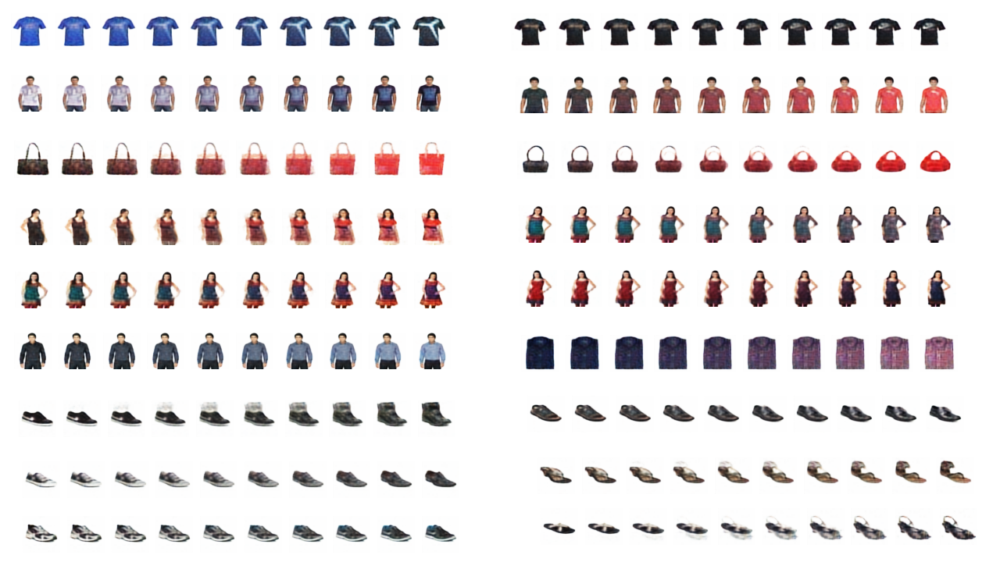

# Variational Autoencoder Tutorial
This is an implementation of variational autoencoders in python.

On Medium:

https://medium.com/mlearning-ai/latent-spaces-part-2-a-simple-guide-to-variational-autoencoders-9369b9abd6f

On Substack:

https://azadwolf.substack.com/p/what-are-variational-autoencoders

